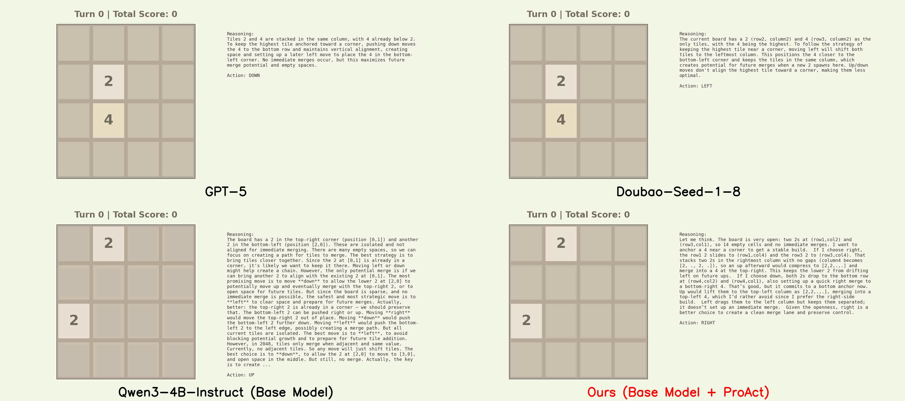
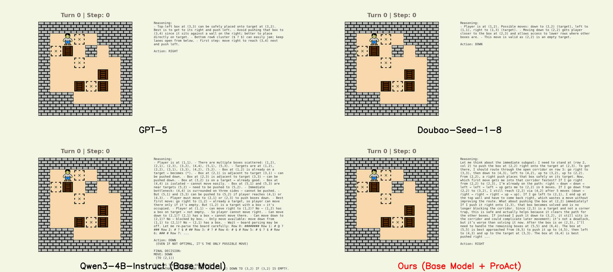

# ProAct: Agentic Lookahead in Interactive Environments

## 🎥 Demos

We compare **ProAct** against leading closed-source models and open-source models on two  long-horizon interactive environments (i.e., 2048 and Sokoban). ProAct exhibits superior foresight and strategic planning capabilities in interactive environments.

- Visualizations on 2048

  <a href="https://github.com/GreatX3/ProAct/blob/main/demos/2048_demo.mp4">
    
  </a>

- Visualizations on Sokoban

  <a href="https://github.com/GreatX3/ProAct/blob/main/demos/sokoban_demo.mp4">
    
  </a>

## 🚀 Inference & Testing

The testing pipeline consists of three steps: downloading the model, deploying it with vLLM, and running the evaluation script.

### 1. Download the Model

Download the pre-trained model from [Hugging Face](https://huggingface.co/biang889/ProAct).

```bash
huggingface-cli download --resume-download biang889/ProAct --local-dir /path/to/ProAct 
```

### 2. Deploy Model using vLLM

Start the vLLM server to serve the model compatible with OpenAI API protocol.

```bash
vllm serve /path/to/ProAct/2048_rl \  # 2048_stf, sokoban_rl, sokoban_sft
  --served-model-name ProAct \
  --host 0.0.0.0 \
  --port 8080 \
  --tensor-parallel-size 1
```

> **Note:** Keep this terminal open while running the tests in a separate terminal.

### 3. Run Testing Script

Once the server is up and running, execute the testing script in a **new terminal window**. This script will interact with the deployed model via the API and generate results.

```bash
# test on 2048
python3 test_proact_on_2048.py
# test on Sokoban
python3 test_proact_on_sokoban.py
```

## 🏋️ Training

🚧 **Full Training Pipeline Coming Soon**

The complete training code for the two-stage paradigm (SFT and RL) is currently being prepared for release. Please ⭐ **Star** this repository to receive notifications when the training code is pushed!

### MC-Critic Preview

**MC-Critic** is a core component of our RL stage. It functions as a **non-parametric critic** that estimates state values directly via lightweight Monte-Carlo rollouts, rather than relying on a learned value network. This provides low-variance value estimates to stabilize training.

You can verify the calculation logic of MC-Critic on the **2048** environment immediately by running:

```bash
# 2048
python3 twentyFortyEightVariantEnv.py
```

## 📜 Citation

If you find this project useful in your research, please cite our paper:

```<BIBTEX>
@misc{yu2026proactagenticlookaheadinteractive,
      title={ProAct: Agentic Lookahead in Interactive Environments}, 
      author={Yangbin Yu and Mingyu Yang and Junyou Li and Yiming Gao and Feiyu Liu and Yijun Yang and Zichuan Lin and Jiafei Lyu and Yicheng Liu and Zhicong Lu and Deheng Ye and Jie Jiang},
      year={2026},
      eprint={2602.05327},
      archivePrefix={arXiv},
      primaryClass={cs.AI},
      url={https://arxiv.org/abs/2602.05327}, 
}
```
